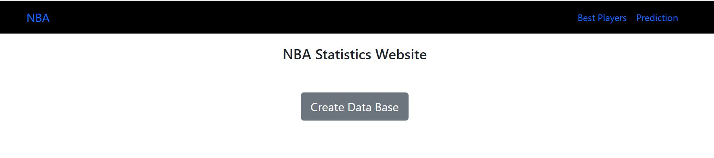
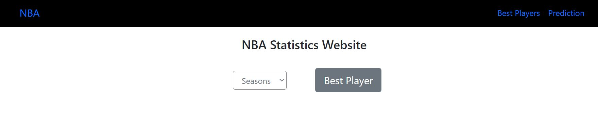
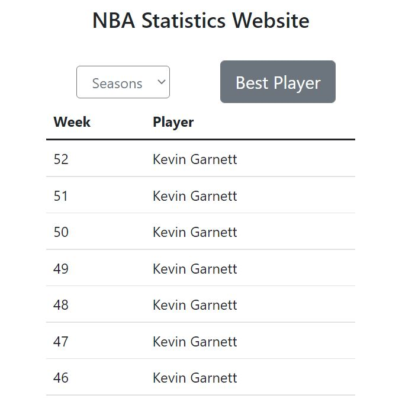
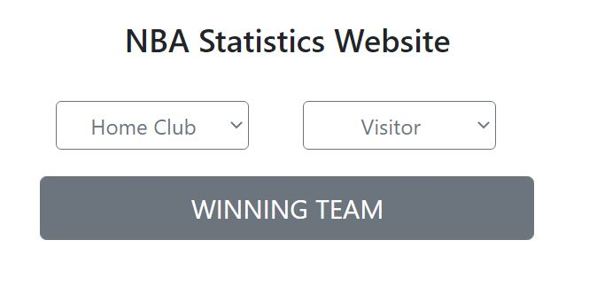
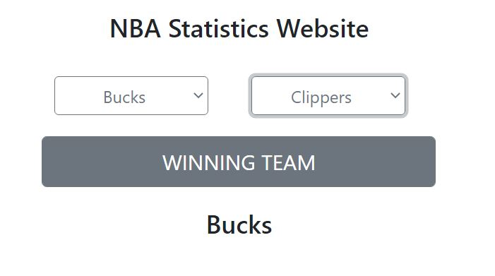

# NBA CLUE TEST APP

Es una aplicación visual de prueba en la que usted podrá:
1. Crear la Base de Datos Normalizada de las Estadísticas de la NBA dado un conjunto de .csv.
2. Dado el valor de una temporada ya jugada, obtener el mejor jugador de cada semana.
3. Dados dos equipos de la NBA obtener el ganador más probable. 

# Detalles del FrontEnd

Para la implementación de la interfaz de usuario se utilizó principalmente la biblioteca [Flask](https://pypi.org/project/Flask/) de python. Para lograr un diseño responsive y de mejor visualidad se emplea [Bootstrap](https://getbootstrap.com/).

## HOME

En la página principal de la aplicación usted podrá:

1. Crear la Base de Datos (Debe tener en cuenta que esto puede tomar unos minutos).
2. Navegar a través de las páginas de nuestra web (Prediction y Best Player)



## Best Player

En esta página podrá obtener el mejor jugador de cada semana durante toda una temporada.





## Prediction

En esta página podrá obtener el posible ganador entre dos equipos de la NBA.





# Detalles del BackEnd

## Creación de La Base de Datos

Para la creación de la BD se utilizaron principalmente dos bibliotecas de python. 
1. [Pandas](https://pypi.org/project/pandas/) para manipular los datos desde los .csv y hacer todos los pasos de la normalizacion. 
2. [Flask_sqlalchemy](https://pypi.org/project/Flask-SQLAlchemy/) para la creación de la BD en MySQL y su consulta. 

En este aspecto podemos mencionar los elementos más relevantes:

1. Se creó el modelo de Base de Datos que no es más que un conjunto de clases que representan cada una de las tablas. Ejemplo:

    ```python
    class Players(db.Model):
        PLAYER_ID = db.Column(db.Integer, primary_key = True)
        Names = db.Column(db.String(100), nullable = False)
        
        def __init__(self, playerId, name):
            self.PLAYER_ID = playerId
            self.Names = name
    ```

2. Se realizan un conjunto de preprocesamiento de los datos, con la ayuda de los DataFrame que permiten obtener un modelo de BD normalizados. Para ello, se eliminaron elementos repetidos, se atomizaron algunos elementos de las tablas y se crearon tablas nuevas que permiten la independencia de los datos. Todo esto puede consultarse en el fichero [createDatabase.py](/utils/createDatabase.py)

## Obtención del mejor jugador

En esta sección solo fue necesario hacer una consulta a la Base de Datos para ello se usaron los recursos de MySQL y SQLAlchemy. La consulta tiene algunos elementos importantes como la obtención de la semana a partir de una fecha dada, lo cual fue resuelto con la función WEEK de MySQL. Puede consultar el fichero [best_player.py](/utils/best_player.py)


## Creación del Modelo de Predicción

Para la creación del modelo de predicción que obtiene el equipo ganador de dos posibles se emplearon las bibliotecas de python: [sklearn](https://scikit-learn.org/stable/install.html) y [numpy](https://pypi.org/project/numpy/). Dentro de sklearn se emplearon las funcionalidades [KernelDensityEstimation](https://scikit-learn.org/stable/auto_examples/neighbors/plot_kde_1d.html) y [RandomForestRegressor](https://scikit-learn.org/stable/modules/generated/sklearn.ensemble.RandomForestRegressor.html). 

Se siguió la siguiente idea para la construcción del modelo de predicción: 

1. Se crea un vector de características con los principales datos de los partidos de cada equipo (% de canastas de 2ptos, % de canastas de 3ptos, % de tiros libres, % de asistencias, % de rebotes, etc.). 
2. Dado ese vector de característica extraído de la Base de Datos. Se define, de entre todos los partidos, el conjunto de entrenamiento y el de evaluación y se predice el resultado en puntos de culaquier partido utilizando Random Forest Regression. 
3. En este puento, se decide crear una simulación de partidos entre los dos equipos para los cuales se quiere predecir el ganador. Y se utiliza este conjunto de partidos simulados como conjunto resultante en la predicción. 
4. Para crear el conjunto de partidos simulados entre ambos equipos se utiliza el algortimo KernelDensityEstimation, en el que se estima la función de probabilidad de cada uno de los elementos del vector de características para cada equipo. Se realiza una ponderación lineal de los datos dándole más peso a los elementos logrados más recientemente en el tiempo. 
5. Finalmente con el conjunto de posibles partidos entre ambos equipos se aplica RandomForest para predicir el resultado de esos encuentros y se devuelve como ganador el que mayor número de victorias obtuvo.

Puede consultar la implemetación en el fichero [prediction.py](/utils/prediction.py)


